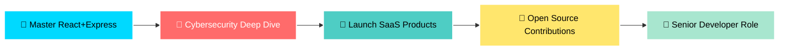

# 👋 Hi, I'm **Mr Dickens**

<div align="center" padding-bottom="10px" >


[](https://github.com/dikie001)
[](https://dikie.dev)
[](https://github.com/dikie001)

</div>

---

<table padding="4px">
<tr>
<td width="50%">

## 🌟 **About Me**

```typescript
const mrDickens = {
  role: "Software Engineer Student",
  focus: ["Clean Architecture", "Scalable Systems"],
  passion: "Cybersecurity + Development",
  mission: "Building secure, elegant solutions",
  learningStyle: "Code → Test → Deploy → Repeat",
  currentMood: "Always shipping 🚀"
};
```

**What drives me:**
- 🎯 **Clean Code Advocate** — Writing maintainable, scalable applications
- 🔒 **Security-First Mindset** — Merging development with cybersecurity
- 📚 **EdTech Innovation** — Creating educational tools for students
- 🎨 **UI/UX Perfectionist** — Crafting smooth, minimal experiences
- ⚡ **Performance Optimizer** — Every millisecond matters

</td>
<td width="50%">

## 🚀 **Tech Arsenal**

### **Frontend Mastery**


### **Backend Power**


### **Tools & Workflow**


</td>
</tr>
</table>

---

## 🛠️ **Featured Projects**

<div align="center">

| Project | Description | Tech Stack | Status |
|---------|-------------|------------|--------|
| **🎓 Elevate** | CBC study app with notes, trivia games & offline quizzes | React Native, TypeScript, LocalForage | 🚀 **Active** |
| **⚡ Focus** | Productivity & task scheduling powerhouse | React, Node.js, MongoDB | 🔨 **In Development** |
| **🤖 Echoes** | AI-powered novels and trivia platform | React, Express, AI APIs | 💡 **Planning** |

</div>

<details>
<summary>🔥 <strong>Project Highlights</strong></summary>

### **Elevate - CBC Study Platform**
- 📱 **Cross-platform** Progressive Web Application
- 🎯 **Grade 9-12 CBC content** with comprehensive coverage
- 🎮 **Gamified learning** through trivia and interactive quizzes
- 📴 **Offline-first** architecture for unrestricted access
- 🎲 **Randomized quizzes** for dynamic learning experiences

### **Focus - Productivity Suite**
- 📊 **Smart scheduling** with intelligent task prioritization
- 🔄 **Real-time sync** across all devices
- 📈 **Progress tracking** with detailed analytics
- 🎨 **Minimal design** focused on distraction-free productivity

### **Echoes - AI Innovation**
- 🤖 **AI-powered content** generation and curation
- 📖 **Interactive storytelling** with dynamic narratives
- 🧠 **Adaptive quizzes** that learn from user behavior
- 🎭 **Immersive experiences** combining entertainment and education

</details>

---

## 📊 **GitHub Analytics**

<div align="center">


</div>

---

## 🎯 **2025 Roadmap**



<div align="center">

### **🎖️ Current Focus Areas**

| 🎯 **Goal** | 📈 **Progress** | 🔥 **Priority** |
|-------------|-----------------|-----------------|
| React/Express Mastery | ████████░░ 80% | 🔴 **Critical** |
| Cybersecurity Skills | ██████░░░░ 60% | 🟡 **High** |
| Portfolio Projects | ███████░░░ 70% | 🟢 **Medium** |
| Open Source Contributions | ███░░░░░░░ 30% | 🔵 **Future** |

</div>

---

## 💭 **Philosophy**

<div align="center">

> *"Code is poetry written in logic. Security is the rhythm that keeps it flowing."*

**🎨 Design Principles I Live By:**
- **Simplicity** over complexity
- **Performance** over features 
- **Security** over convenience
- **User experience** over developer convenience
- **Learning** over knowing

</div>

---

## 🤝 **Let's Build Something Amazing**

<div align="center">

[](https://github.com/dikie001)
[](https://dikie.dev)
[](mailto:omondidickens255@gmail.com)

---


**⚡ Always building. Always learning. Always leveling up. ⚡**

*Crafted with 💙 and lots of ☕*

</div>
